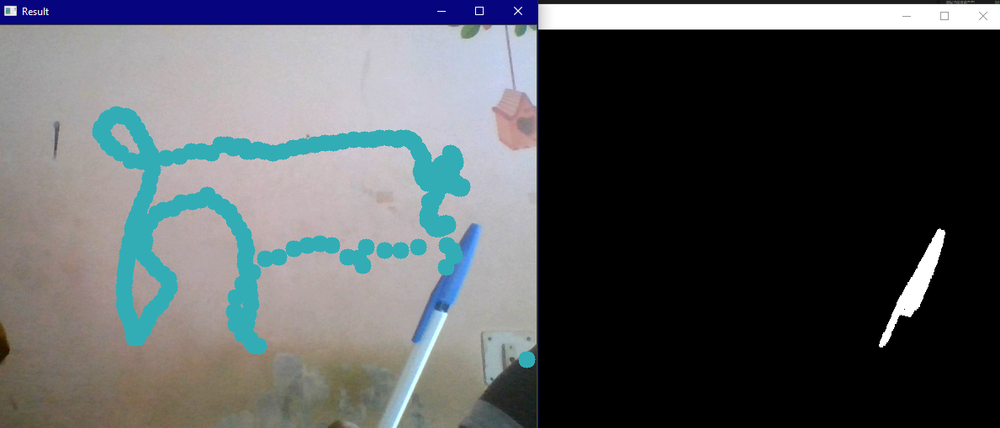
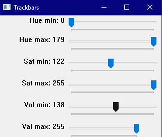
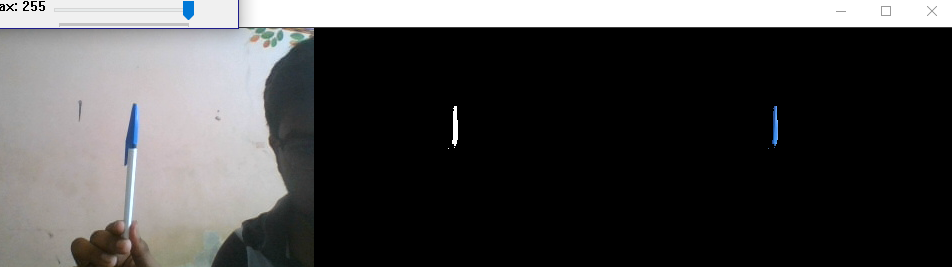
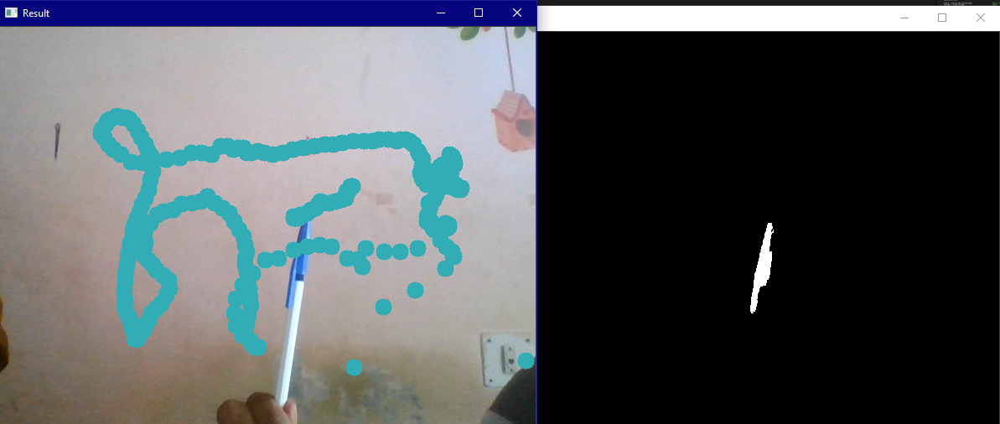

# Virtual-Paint

This is a basic Python application created in VS code with which you can virtually draw in your screen.

**Final Output:**

 

**TrackBar settings:**
 
 

 

**HSV Configuration using Trackbar:**
 
 

 

**Final Output:**
 
 

 

**SetUp:**

Go to command prompt.
In the project directory, you can run:

`py -3 -m venv venv`

This command is used to install the virtual environment.

`venv\Scripts\activate`

This command is used to activate the environment (in Windows).

`. venv/bin/activate`

This command is used to activate the environment (in Mac OS).

`pip3 install opencv-python`

This command installs OpenCV (for Python3 version)

`pip install opencv-python`

This command installs OpenCV (for Python2 version)

**Requirements:**

1. VS Code
2. Environment setup
3. Python (version 2.7 or above)
4. OpenCV
5. Blue Colour capped Marker pen (for this project)
